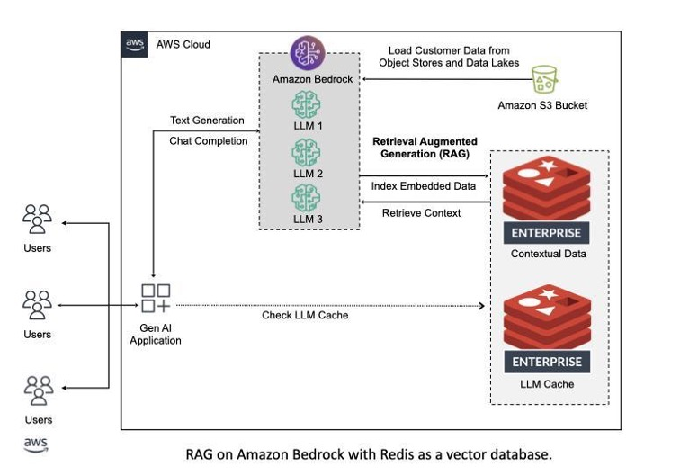

-------
# AWS Bedrock & Redis Enterprise

💪🏼 Introducing the integration of AWS Bedrock and Redis Enterprise: a game-changer for generative AI applications. This collaboration offers a robust, scalable, and efficient solution for developers, streamlining the use of LLMs with Redis as a vector database. Dive into our new reference architecture to harness the full potential of Retrieval-Augmented Generation (RAG) in your projects.

🧠 The above reference architecture highlights AWS Bedrock and Redis Enterprise as a vector database. The Bedrock integration handle the following for customers:
1. Loading content from a data source (S3)
2. Creating vector embeddings with a chosen LLM
3. Storing and indexing embeddings within Redis Enterprise as a vector database
4. Performing semantic search to extract relevant context from the vector database during [RAG](https://docs.aws.amazon.com/sagemaker/latest/dg/jumpstart-foundation-models-customize-rag.html)

⚡ Additionally, Redis should be utilized as an [LLM Cache](https://www.redisvl.com/docs/html/user_guide/llmcache_03.html) to improve throughput of responses while cutting down on costs.

------

# Getting Started

## Redis Enterprise Cloud Setup

To setup Redis Enterprise Cloud as your [vector database](https://redis.com/solutions/use-cases/vector-database) via the AWS Marketplace, please follow the instructions [here](./docs/redis-enterprise-cloud-setup.md).

## Vector Index Creation
To create your Bedrock vector index in Redis, please follow the instructions [here](./docs/vector-index-creation.md).

## AWS Bedrock Setup
To configure AWS Bedrock for your generative AI applications, please follow the instructions [here](./docs/aws-bedrock-configuration.md).

_____

# Community Examples
Go ahead and get a taste of AWS Bedrock by running a few [examples](./examples) yourself. These will continuously update once the integration is live and as community developers add more examples.
