------

# AWS Secret Manager

## Setting up AWS Secrets for Redis Endpoint configurations

It's typically not recommended to hardcode Redis endpoint details such as server host name, username, password etc. The solution is to leverage AWS Secrets manager. Following procedure outlines setting up Redis endpoint configurations as AWS Secrets.

You will need:

```
Redis Enterprise Cloud Database Hostname
Redis Enterprise Cloud Database Port Number
Redis Enterprise Cloud Database Password
Redis Enterprise Cloud Database Server & Client certs for TLS
```
Start from AWS web console and search for `Secret` in the search box. Select `Secrets Manager` service.

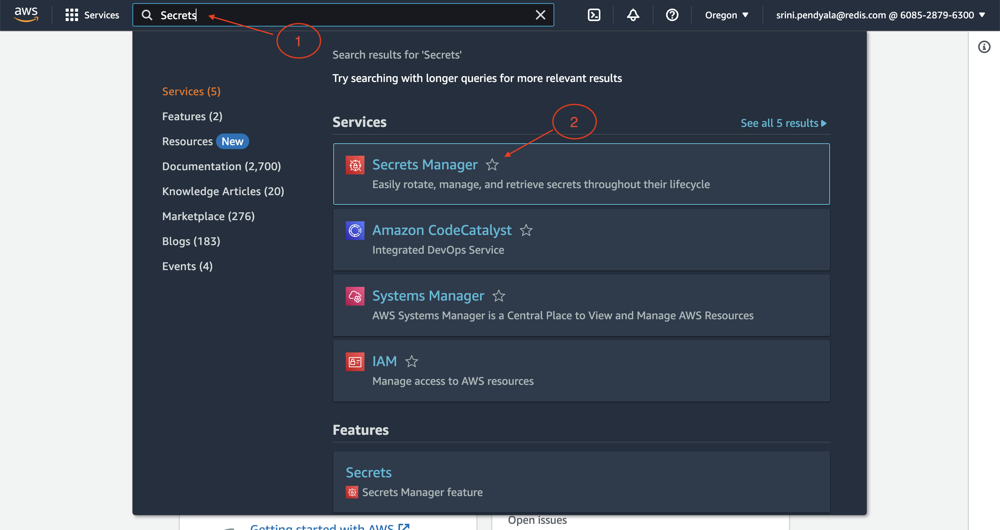

Click on `Store a new secret`.

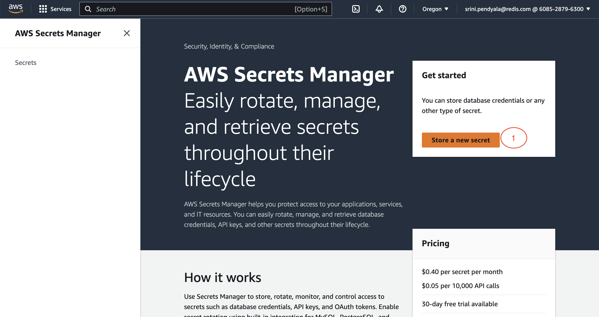

Choose `Other type of secret` (Annotation 1) and select `Key/Value` (Annotation 2) and enter values for `username` and `password` (Annotation 3) for youre Redis database endpoint. You add new key/pair values using `+ AddRow` button (Annotation 4)

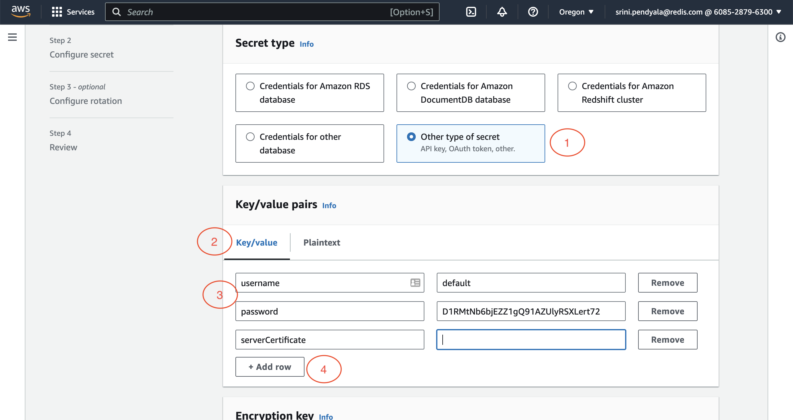

For the key `serverCertificate`, enter the contents of the server certificate (ex: `redis_ca.pem` file contents), as shown.

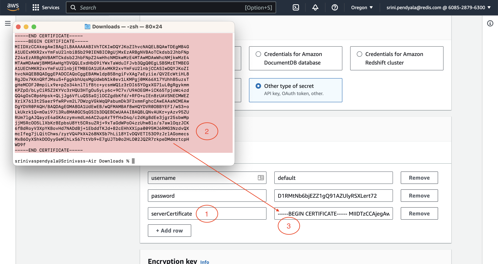

Similarly for `clientCertificate`, enter the contents of the client certificate (ex: `redis_user.crt`), as shown.

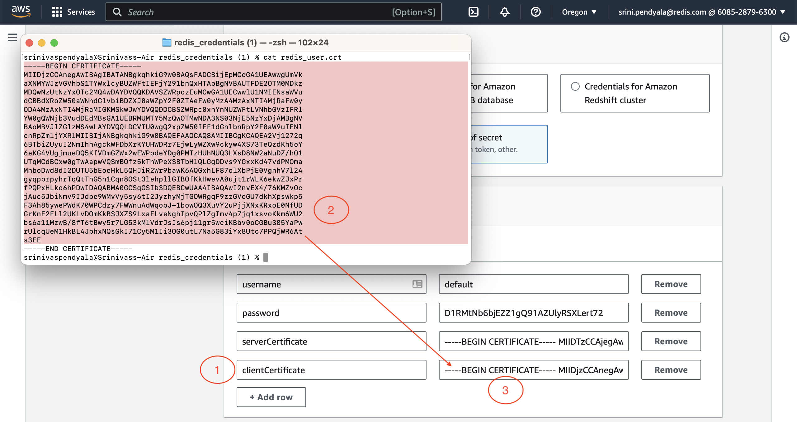

Finally for `clientPrivateKey`, enter the contents of the client private key (ex: `redis_user_private.key`), as shown.

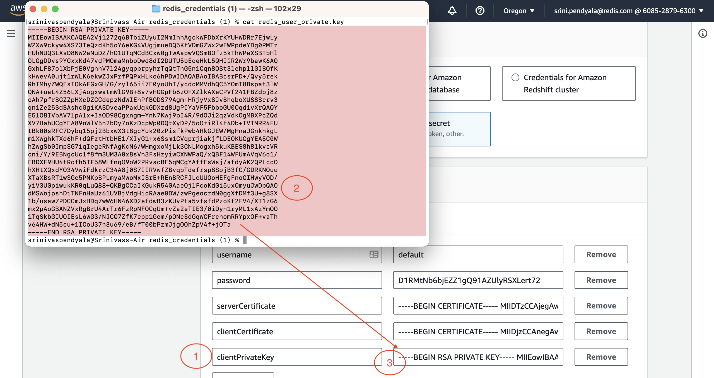

After entering all of the Redis endpoint details, the configurations would look something like this:

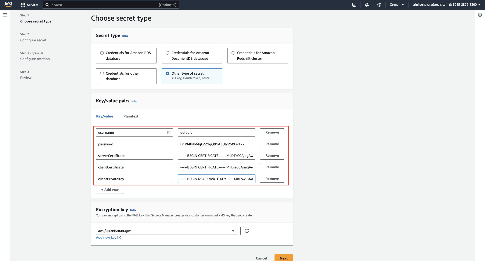

Give your secrets a name and description.

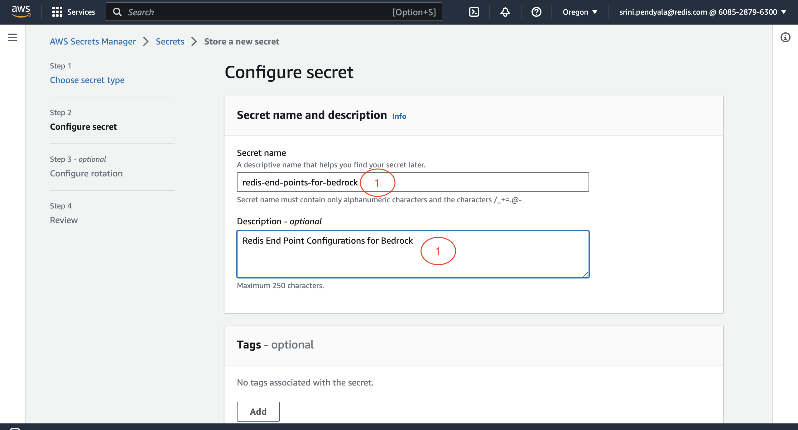

Leave all of the configuration option with default values. 
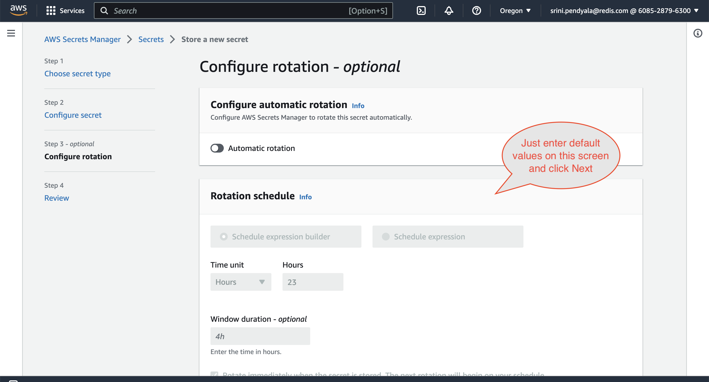

Finally click on the `Store` button to save these secret configurations. 
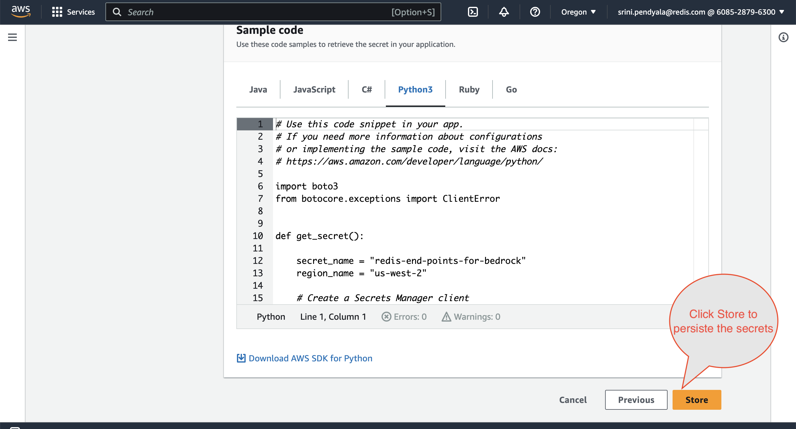

You will be navigated back to the main UI page that enlists your secret to confirm the successful creation of the same.
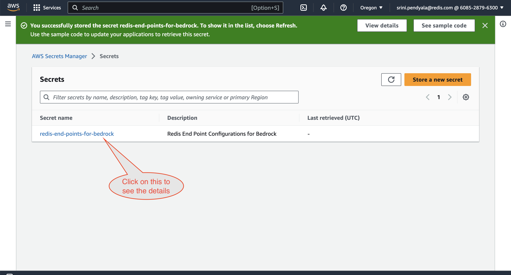

When you click on the secrets, the details page has the ARN details that would be needed to pass it to Bedrock programatically or via a web console. 

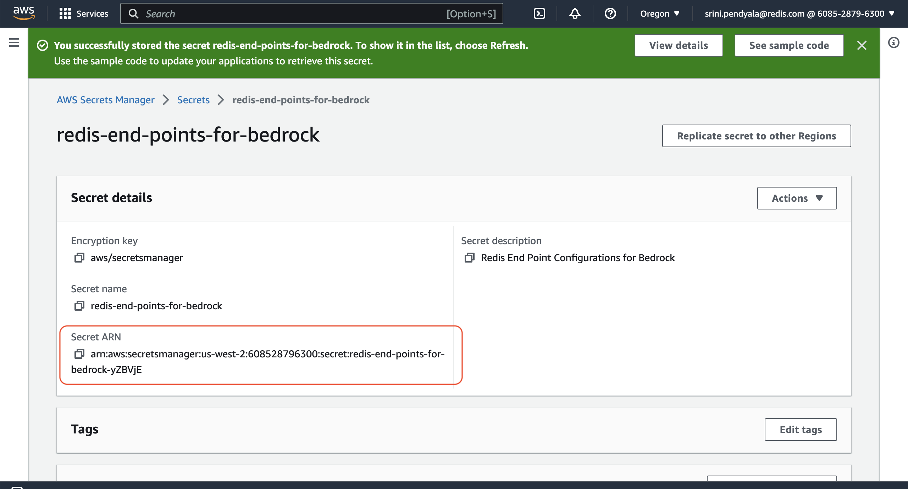
