-------

# Vector Index Creation

## Objective
To integrate with AWS Bedrock, you must create a vector index in Redis to house your vectorized data.

> ✍️ Prerequisite: Ensure that your Redis Enterprise Cloud database is [active with TLS enabled](redis-enterprise-cloud-setup.md#tls-setup-for-your-redis-database) and certificate files (`redis_ca.pem`, `redis_user_crt.pem`, and `redis_secret_crt.pem`) downloaded.

> ✍️ Prerequisite: You will need the free [RedisInsight](https://redis.com/redis-enterprise/redis-insight/#insight-form) GUI for this task.

## Setup Procedure

### 1. Connect to Your Database in RedisInsight
While using RedisInsight (RI) is not stricly required, RI provides the easiest route for us to create a vector index for Bedrock. Alternatively you can utilize any number of our supported client libraries and the Redis CLI.

Start with downloading RedisInsight. To test client connections with `TLS` turned on, go ahead and download RedisInsight. This can be done directly by clicking on the `Connect` button on your database, within Redis Web console. Under `RedisInsight Desktop` section, you can see a `Download` drop down for your OS platform. Go ahead and download (Annotation 3)
You will need the `Public endpoint` connection details (Annotation 1 and 2), to connect from RedisInsight.

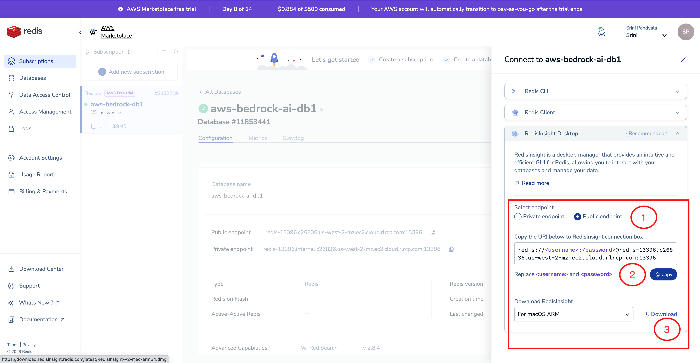

Go ahead and download and install RedisInsight. Here is an example screenshot for Mac OSX. Windows installation may be slightly different but it should be self explanatory.

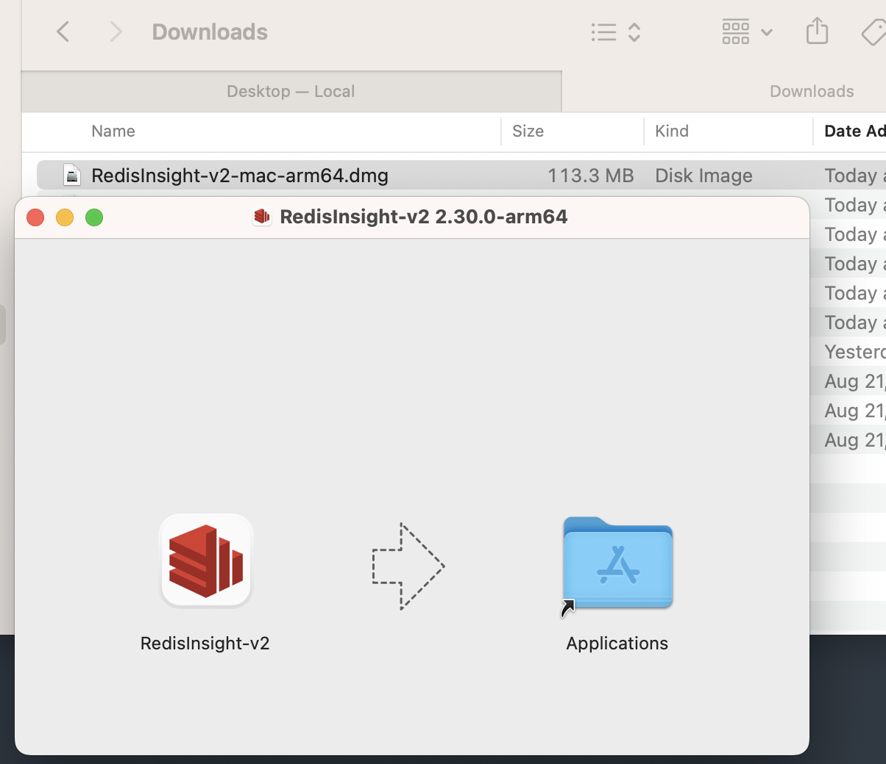

Once RedisInsight is installed, you are welcomed to the main screen as shown below.

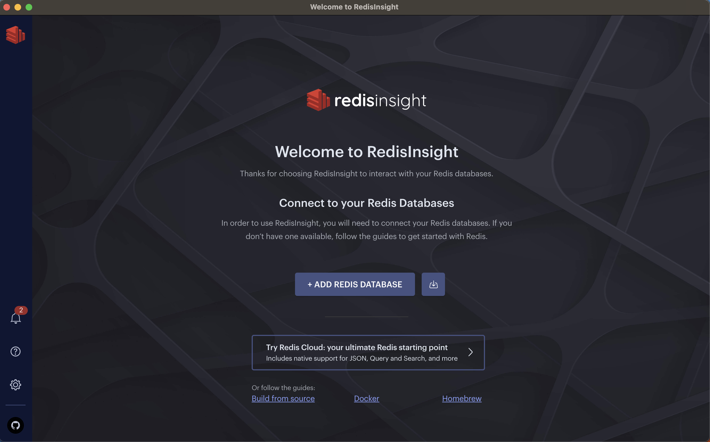

Click on the `Add Database Manually`

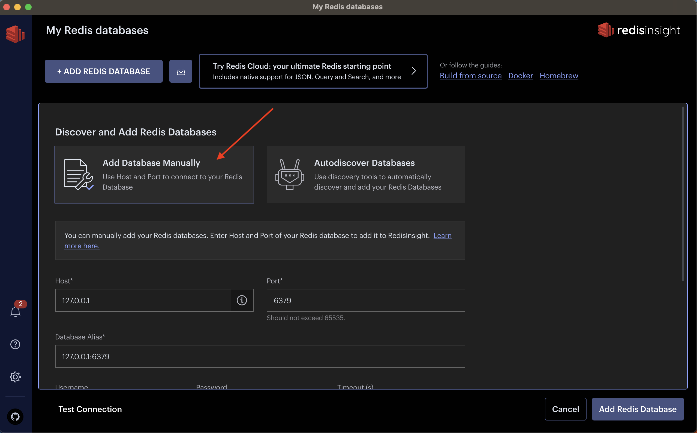

Copy the details of the `Public endpoint`

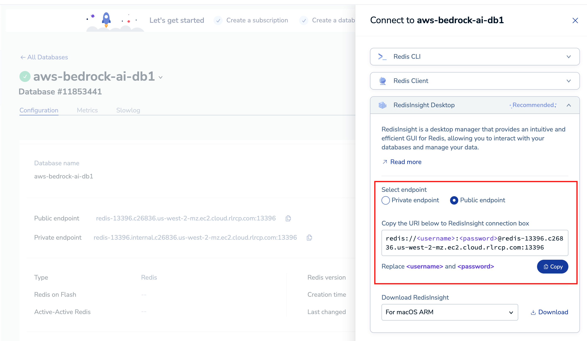

And paste the details by placing your cursor in the `Database Alias` (Annotation 1). Rest of the fields like `Username`, `Password` etc, gets automatically filled in. (Annotation 2)

Since we enabled `TLS` (both serverside and client side), we need to let RedisInsight know to present the certificates to connect to the Redis endpoints. To do this, you will select TLS checkbox ON (Annotation 3) and select `Add new CA certificate` (Annotation 4)

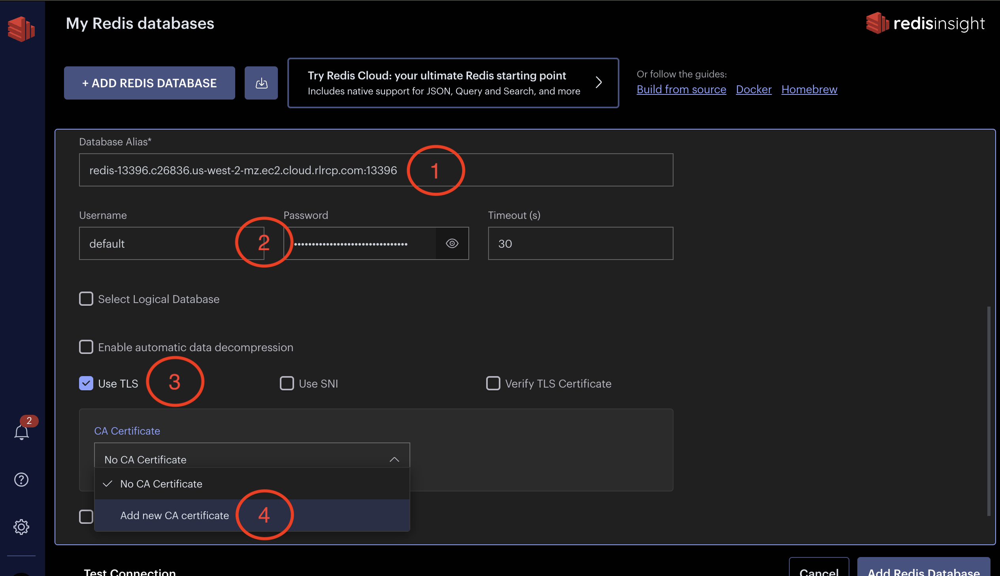

Copy the contents of `redis_ca.pem` file. Make sure to include the entire contents of the file, including `----BEGIN CERTIFICATE-----` and `-----END CERTIFICATE-----` etc.

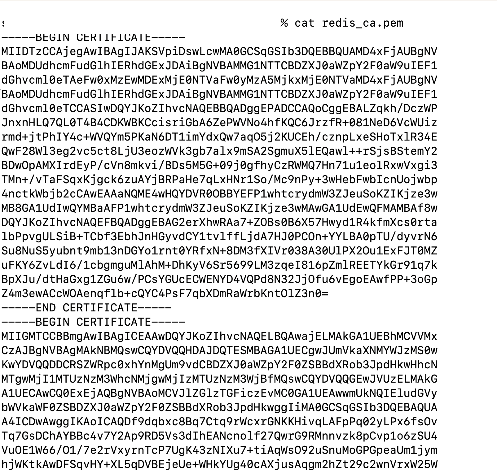

And past the contents in the `Certificate` textbox as shown.

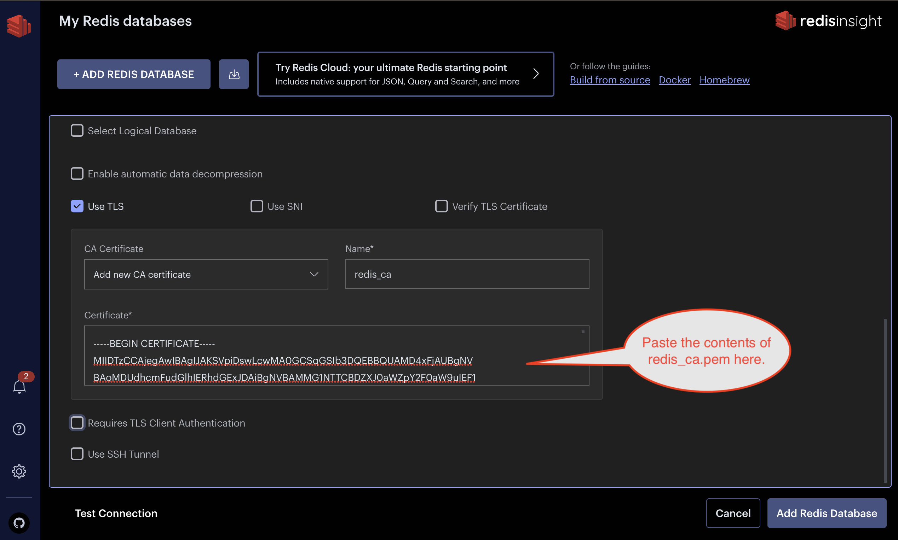

Similarly, go ahead and copy the contents of the client certificates and paste it in the RedisInsight : `Requires TLS Client Authentication` section.

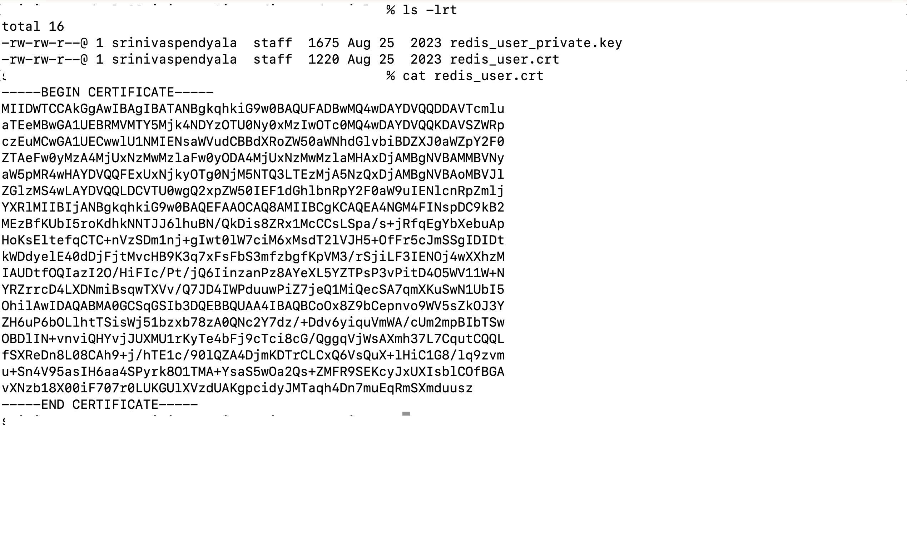

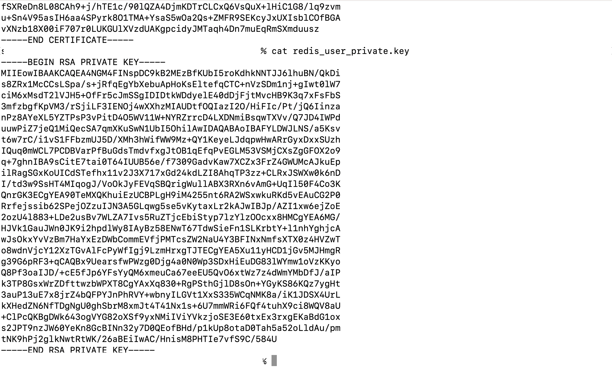

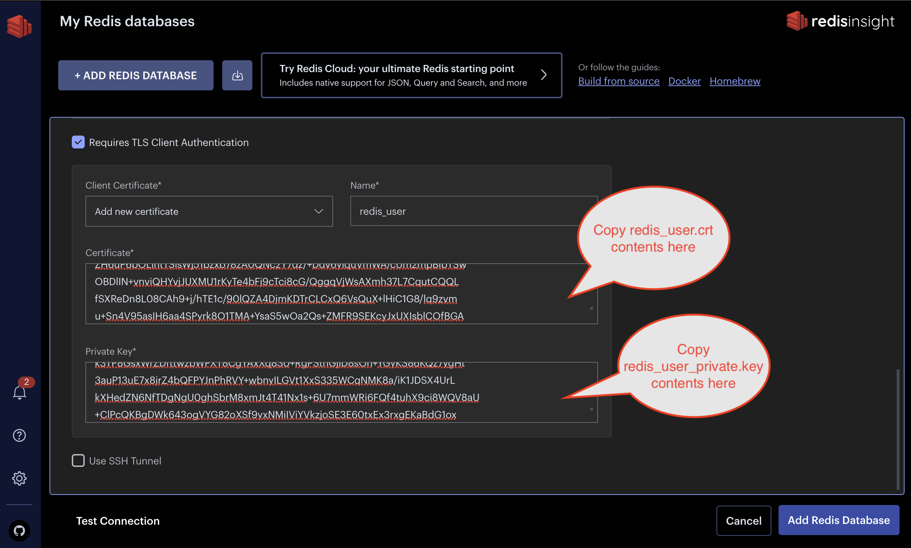

Once you click on `Add Redis Database` button, you will see that your database has been added successfully.

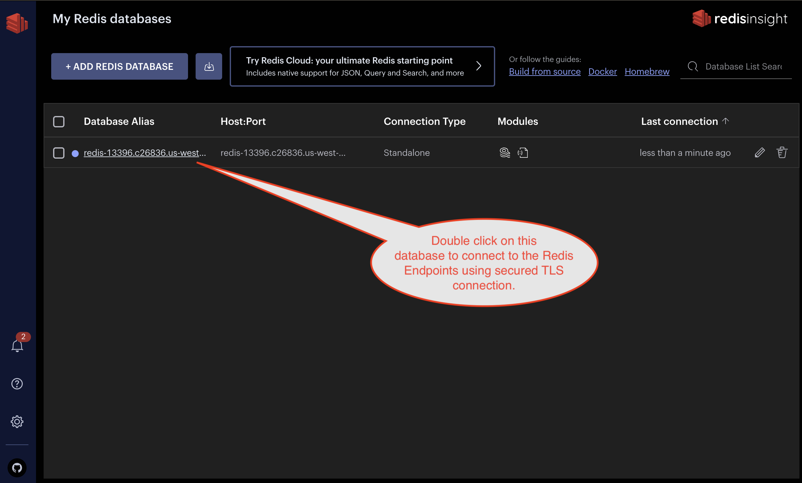

Click on the database to connect. Since the database is all empty, when you search for keys, you will not find any data.

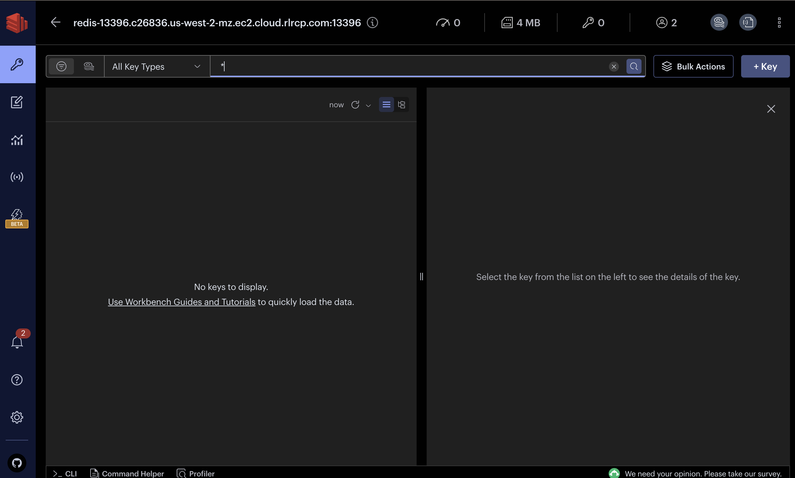

That is it, you are all set with Redis setup and connecting to the Redis datbase using a Redis Client like RedisInsight.

### 2. Create Vector Index for Bedrock
Navigate to "Workbench" on the sidebar and note the user guides. Openthe guide on "Vector Similarity Search".

Given the options available, choose to create a FLAT index.

> 💡 Redis supports two index types: FLAT and HNSW. FLAT is apt for smaller datasets needing precision, while HNSW suits larger datasets prioritizing speed over some accuracy. For more details, read about the supported index types [here](https://redis.io/docs/interact/search-and-query/search/vectors/#create-a-vector-field).

We need to update the provided index creation script with settings that are relevant to Bedrock. Here's what we need to include:

- Index name: `bedrock-idx` (fully customizable)
- Vector field: `FLAT` vector field with `1536` dimensions, using the `COSINE` metric

> 💡 Embedding dimensions are determined by the selected embedding model on the Bedrock data integration page. 1536 are the output dimensions of the default Titan LLM provided by AWS.

> 💡 As of this launch, Bedrock will not perform any metadata filtering (on the roadmap). So we do not need to include any additional fields for metadata at this time.

Execute the script, as seen below, using the green arrow.

And you will see a confirmation like this:

**Upon seeing "OK", you're all set to [complete your Bedrock integration]()!**
