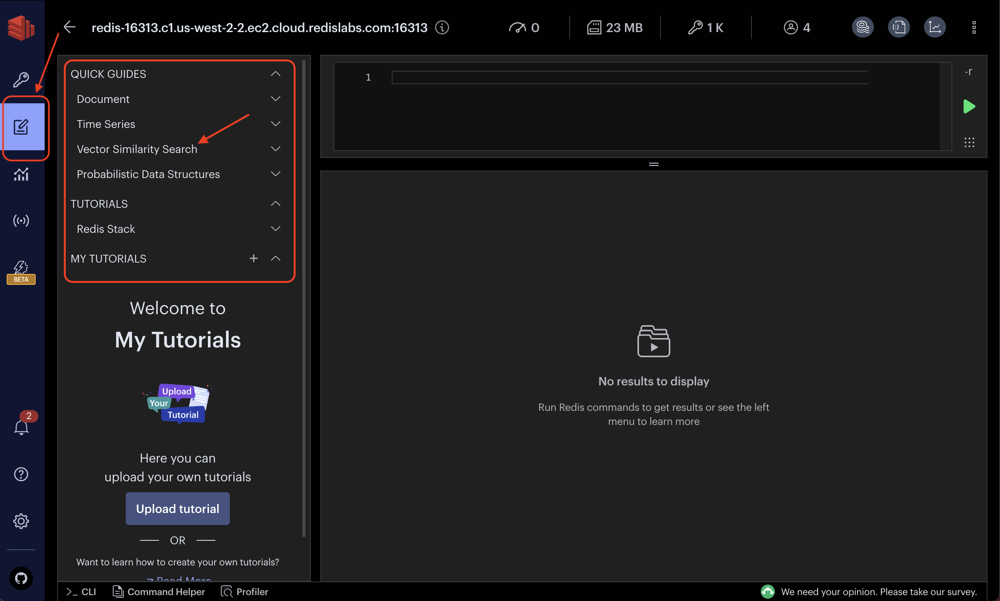
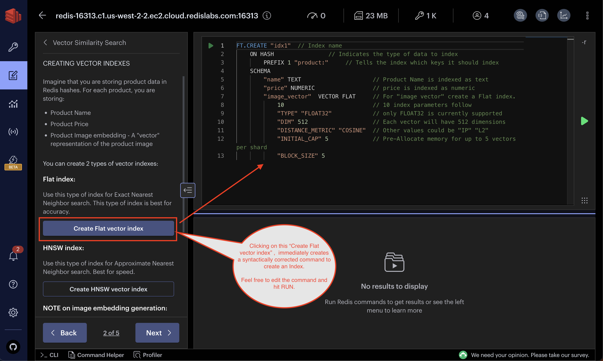
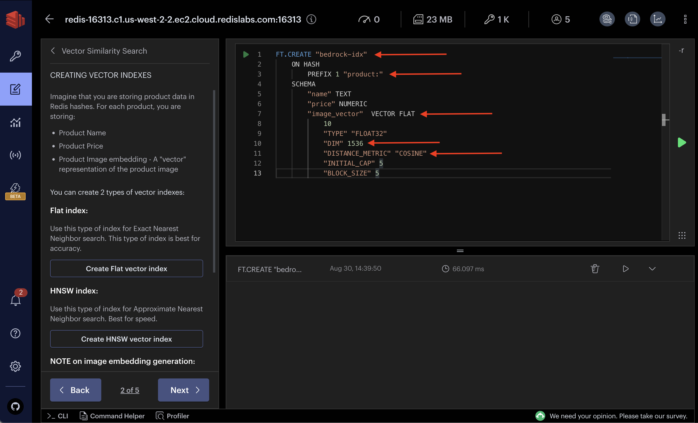
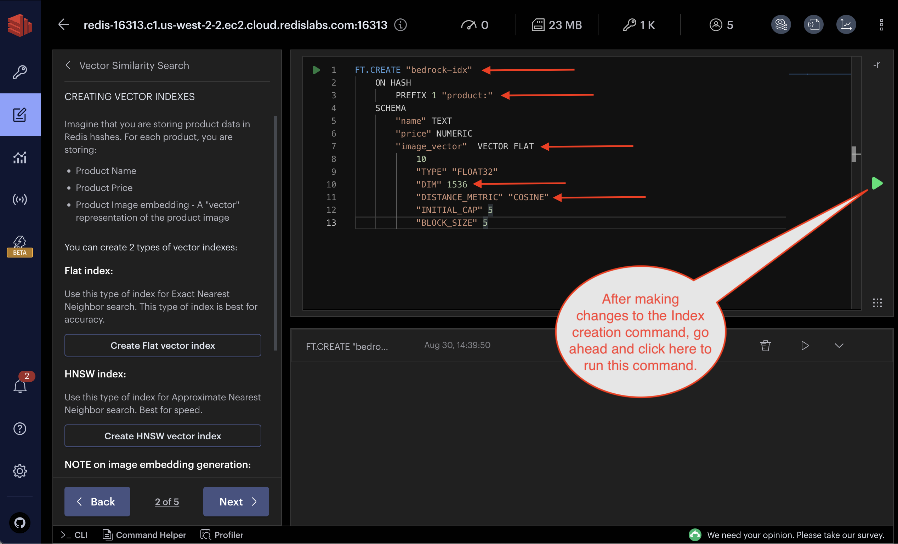
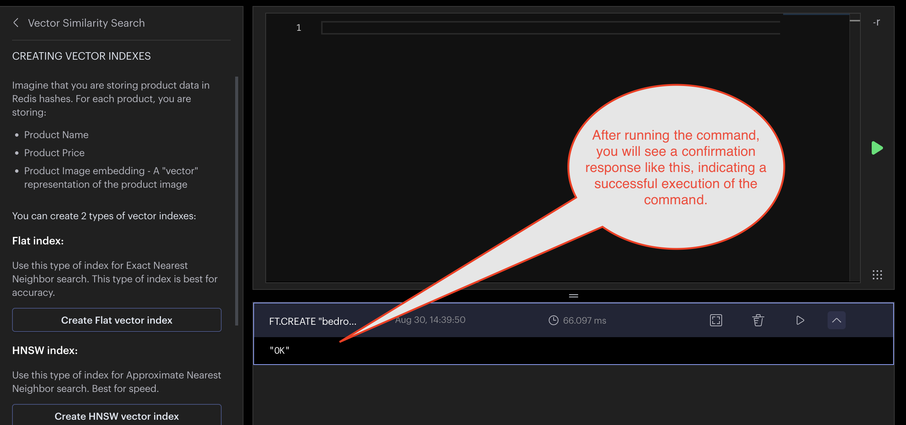

-------

# Vector Index Creation

## Objective
To integrate with AWS Bedrock, you must create a vector index in Redis to house your vectorized data.

> ✍️ Prerequisite: Ensure that your Redis Enterprise Cloud database is [active with TLS enabled](redis-enterprise-cloud-setup.md#tls-setup-for-your-redis-database) and certificate files (`redis_ca.pem`, `redis_user_crt.pem`, and `redis_secret_crt.pem`) downloaded.

> ✍️ Prerequisite: You will need the free [RedisInsight](https://redis.com/redis-enterprise/redis-insight/#insight-form) GUI for this task.

## Setup Procedure

### 1. Connect to Your Database in RedisInsight
While using RedisInsight (RI) is not stricly required, RI provides the easiest route for us to create a vector index for Bedrock. Alternatively you can utilize any number of our supported client libraries and the Redis CLI.

[Follow these steps](redis-enterprise-cloud-setup.md#connect-with-redisinsight) to connect your Redis Cloud database to RedisInsight.

### 2. Create Vector Index for Bedrock
Navigate to "Workbench" on the sidebar and note the user guides. Openthe guide on "Vector Similarity Search".

Given the options available, choose to create a FLAT index.

> 💡 Redis supports two index types: FLAT and HNSW. FLAT is apt for smaller datasets needing precision, while HNSW suits larger datasets prioritizing speed over some accuracy. For more details, read about the supported index types [here](https://redis.io/docs/interact/search-and-query/search/vectors/#create-a-vector-field).

We need to update the provided index creation script with settings that are relevant to Bedrock. Here's what we need to include:

- Index name: `bedrock-idx` (fully customizable)
- Vector field: `FLAT` vector field with `1536` dimensions, using the `COSINE` metric

> 💡 Embedding dimensions are determined by the selected embedding model on the Bedrock data integration page. 1536 are the output dimensions of the default Titan LLM provided by AWS.

> 💡 As of this launch, Bedrock will not perform any metadata filtering (on the roadmap). So we do not need to include any additional fields for metadata at this time.

Execute the script, as seen below, using the green arrow.

And you will see a confirmation like this:

**Upon seeing "OK", you're all set to [complete your Bedrock integration]()!**
