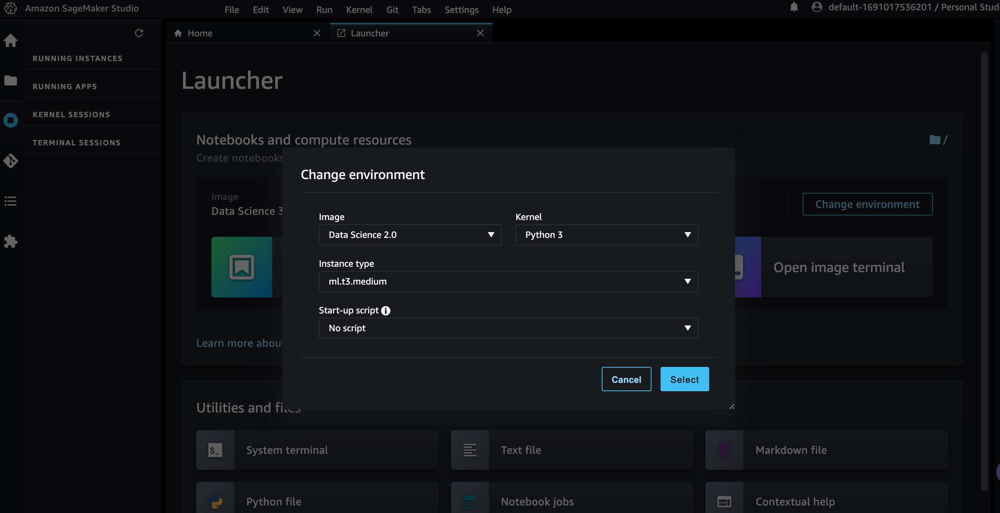
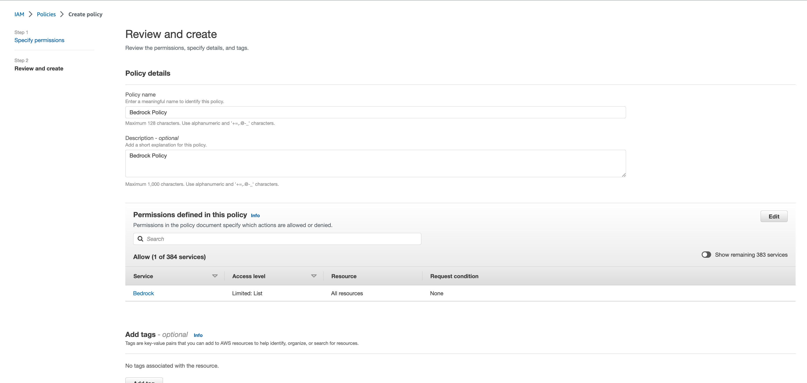
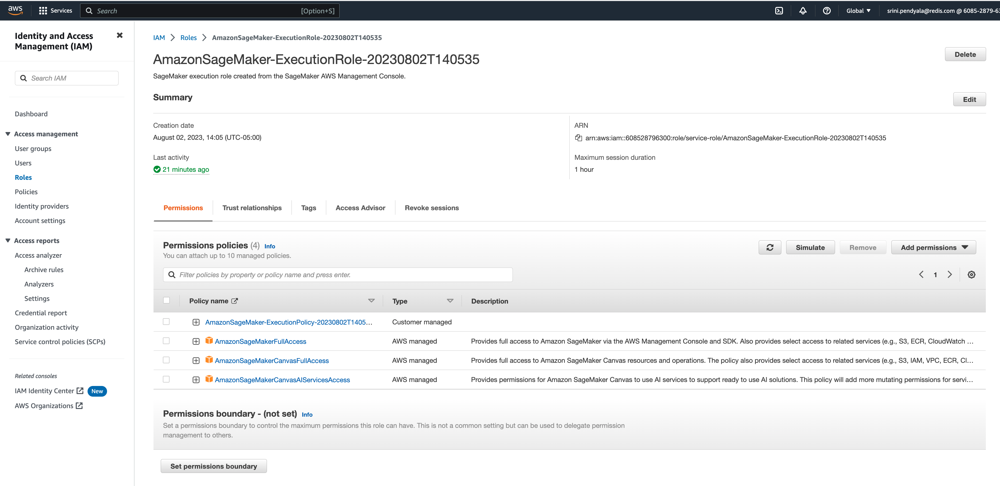
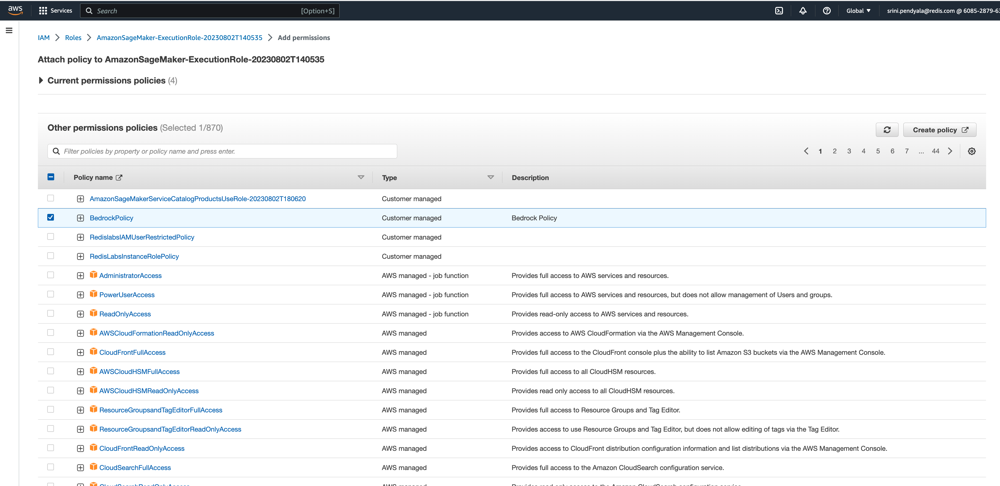
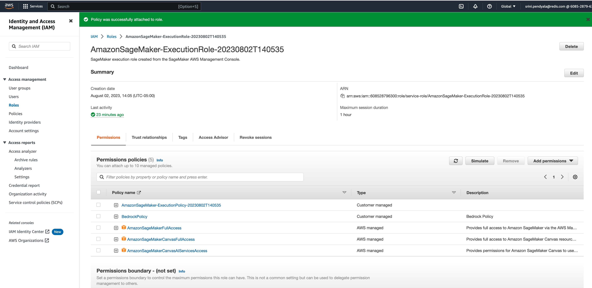
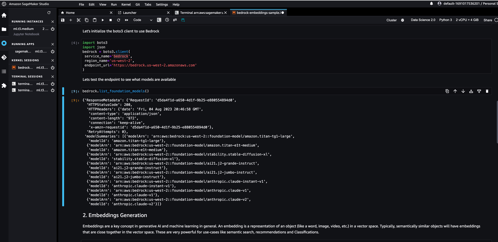

# Running example notebooks

To run these example notebooks, please follow these instructions.
1. Fireup Amazon SageMaker Studio.
2. Launch a Jupyter Notebook with the following runtime configurations:

  

3. Downoad Bedrock Python SDK from [here](https://d2eo22ngex1n9g.cloudfront.net/Documentation/SDK/bedrock-python-sdk.zip)
4. Unzip the SDK archive to access .whl files.
5. Move the .whl files in to a new directory.
6. Now start executing each cell in the Jupyter Notebooks and you should be in the game.

# IAM Policy setup for invoking Bedrock APIs.
Create an IAM policy like this in the policy editor:
```JSON
{
    "Version": "2012-10-17",
    "Statement": [
        {
            "Sid": "BedrockPolicySid",
            "Effect": "Allow",
            "Action": "bedrock:ListFoundationModels",
            "Resource": "*"
        }
    ]
}
```

And give this policy a name called `Bedrock Policy`


Then go ahead and add this to the your SageMaker Execution Role, like this:






Now when you execute the `bedrock.list_foundation_models()` it runs without any errors.


